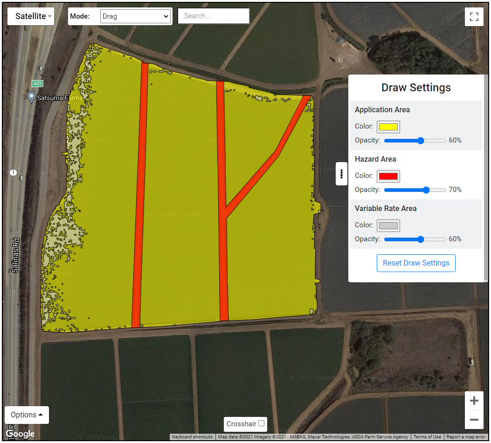

<h1 align = "center"><strong>Parabug Estimate Solutions Tool</strong></h1> 

  
 

<https://parabug.xyz/>

 

# **Table of Contents**

- [**Introduction**](#introduction)
    - [**Application Area**](#application-area)
    - [**Hazard Area**](#hazard-area)
    - [**Variable Rate Area**](#variable-rate-area)
- [**Core Technologies**](#core-technologies)
- [**Map Features**](#map-features)
  - [**Drawing**](#drawing)
  - [**Geometric Processing and Validation**](#geometric-processing-and-validation)
  - [**Overlays**](#overlays)
  - [**Variable Rate Area Auto Generation**](#variable-rate-area-auto-generation)

 

# **Introduction**

The [Parabug Estimate Solution Tool](https://parabug.xyz/) is a web application developed for [Parabug](https://www.parabug.solutions/), an AgTech company specializing in agricultural pest management through the use of biologicals via drone, and serves to streamline and standardize the job request process from potential clients to Parabug.

The job request process involves clients filling out various inputs for contact information and preferences as well as creating a geographic application map through the interactive tools embedded into a Google Maps instance. This application map is saved as a KML file and consists of 3 types of elements:
### **Application Area**

- The outer-most bounding area in which the client would like Parabug to deploy their anti-pest biologicals. This deployment rate of the biologicals is specified by the client. (e.g. 5,000 bugs per acre).

### **Hazard Area**

- One or more areas within the Application Area where the bug deployment rate should be 0.
### **Variable Rate Area**

- One or more areas within the Application Area where the bug deployment rate will be different from the standard rate, allowing for the accommodation of pest hot/cold spots. 
The process completes when the customer submits the request, which emails the application map and customer data to Parabug and emails the customer a summary of the request. Parabug will then follow up for confirmation.

 

<h3> Mapping Tool </h3>

 
 

# **Core Technologies**

- **Node.js** and **Express** for backend framework.
- **Nodemailer** for automated emailing system.
- **Google Maps API** for mapping.
- **JavaScript Topology Suite (JSTS)** for validation and processing of geographic geometry. 

 

# **Map Features**

## **Drawing**

> Users can manually draw in the Application, Hazard, and Variable Rate polygons by dropping a series of points while in the corresponding mode. Points are made by clicking the map or using the “crosshair” feature. Each point is automatically connected to the last by a line and the polygon completes when a new point is placed on top of the first point. Each type of polygon has an opacity and color which can be changed by the user.

 

## **Geometric Processing and Validation**

> Most processing of geometry on the geographic plane utilized the JSTS library. The following processes are performed whenever any polygon is added to the map: 
> - Non-polygons are deleted. This includes any shape with less than 2 points.
> - Self-intersecting polygons are deleted. A polygon’s lines cannot cross itself.
> - Hazard and Variable Rate polygons are trimmed to be contained within an existing Application Area. They cannot be drawn without an Application Area present.
> - Variable Rate Areas are trimmed to not overlap with Hazard areas.
> - Polygons of the same type (Hazard or Variable Rate areas) union with each other if they overlap.

 

## **Overlays**

> Users can import overlays from the following file types:
> - Shapefile (.zip)
>   - .zip file must contain .shp and .dbf files.
> - GeoJson (.json)
>   - Only polygons and multi-polygons within a "FeatureCollection" object are parsed.
> - KML (.kml)
> - KMZ (.kmz)
>   - .kmz file should contain .kml file and any referenced images (href). Images references must be local, not urls.
>   - Current implementation supports ground overlay elements and elements natively supported within. [Reference](https://developers.google.com/kml/documentation/kmlreference#groundoverlay)
>   - Added support for gx:LatLonQuad element within ground overlays via forked GeoXML3
> - GeoTiff (.tif)
>
> 
>
> Overlays are imported and added to the map as one or more layers. The import settings changed based on the type of file imported. For Shapefile, GeoJson, and KML files, the geographic pathing data and colors are imported as-is without much modification. For KMZ and GeoTiff files the data is converted through a “**tileization**” function, which breaks each layer’s data up into a series of smaller geographic tiles. KMZ and GeoTiff files tend to only provide an image to be placed on the map and its geographic bounding box, making points within the bounding box geographically ambiguous otherwise.
> 
> **Tileization** can be thought of as mapping the pixels of the original image to tiles on a geographic plane. Each tile represents 1 or more pixels from the original image. The tile’s size is specified by user input, in feet, and the color is obtained by finding the most frequent pixel color among the pixels it represents from the original image.
> 
> All overlays on import can have a color palette applied to them. This color palette is either user-generated or auto-generated, and maps the original colors from the image to a from the color palette color. Color palette generation and application are done through processes which combine color frequencies and Euclidean color distance. These functions, “applyColorPalette” and “generateColorPalette", are found and described in the “GMapsOverlayLayer” class.
> 
> ---
> 
> ### 1) KMZ File Import and Tile + Color Palette Settings
> 
> 
> 
>  
> 
> ### 2) KMZ Tileized on Map With Color Palette Applied
> 
> 

 

## **Variable Rate Area Auto Generation**

> The VRA Auto Generation tool allows the user to select a tile by its color which is currently displayed on the map. After selecting the tile, every tile in the same layer with the same color is also “selected”. Variable Rate Areas are then generated and drawn around each tile selected. If an Application Area was not present during this selection, one will be automatically generated as a concave hull around all existing tiles in the layer selected (not just the color selected).
> 
>  
> 
> ### 1) Color Selection in VRA Auto Generation Tool (No Application Area Drawn)
> 
> 
> 
>  
> 
> ### 2) Variable Rate Areas Generated From Color Selection
> 
> 